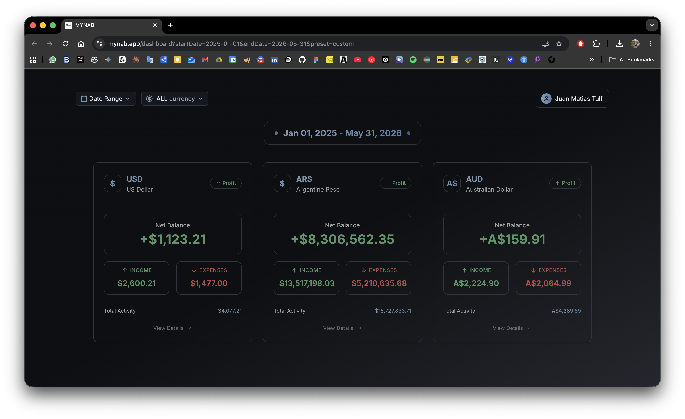
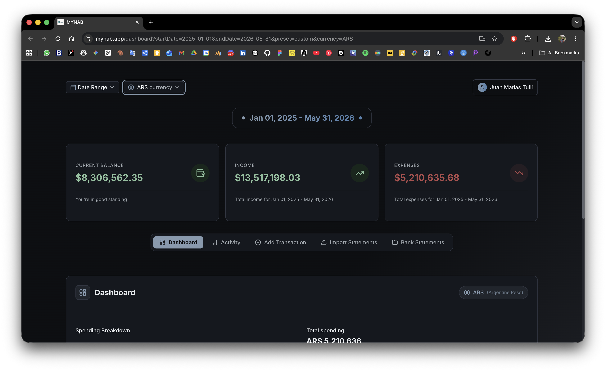
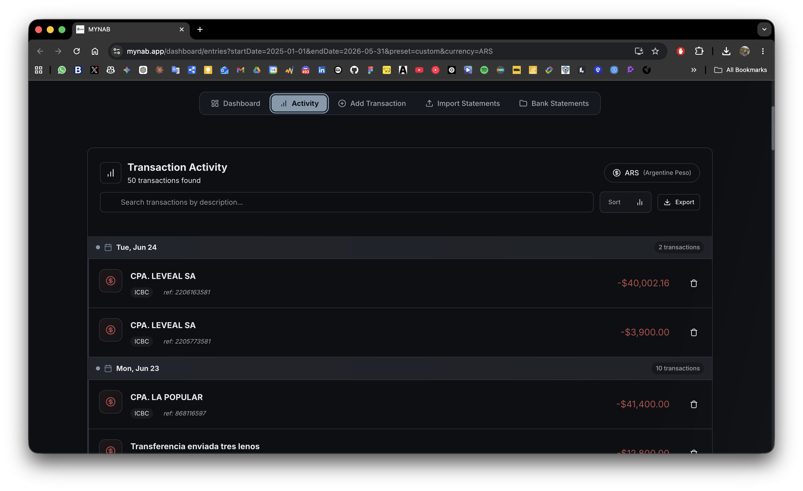
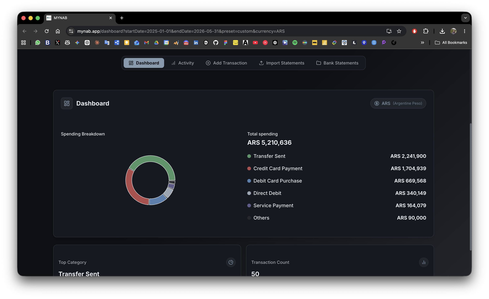
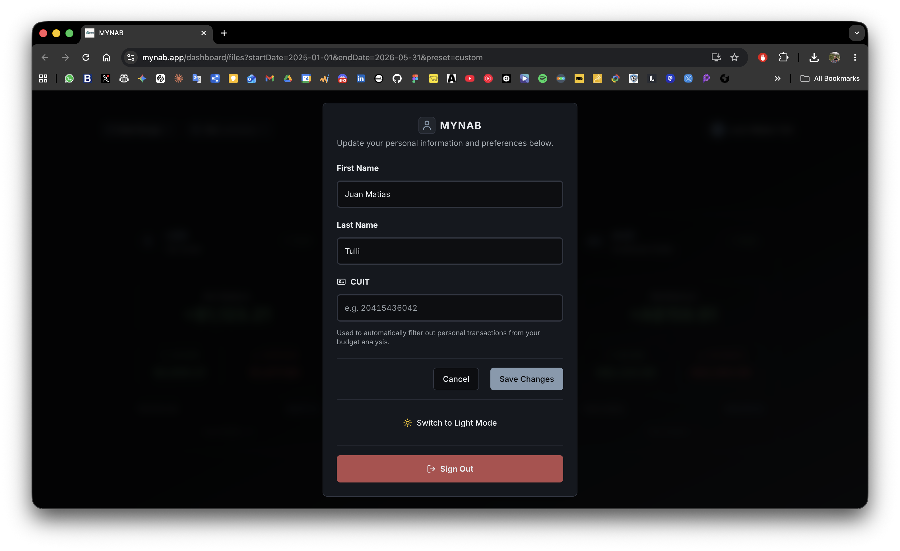

# 💰 MYNAB - Maybe You Need A Budget

A modern, feature-rich personal budgeting application built with **FastAPI** backend and **React** frontend. MYNAB helps you track expenses, manage multiple currencies, and take control of your finances.

---

## 🎯 Features

- 📊 **Multi-Currency Support** - Manage finances across multiple currencies simultaneously
- 💳 **Transaction Management** - Track income and expenses with automatic categorization
- 📁 **Bank Statement Import** - Support for multiple bank formats (ICBC, Santander Rio, MercadoPago)
- 🔐 **Secure Authentication** - Passwordless authentication with JWT tokens
- 🎨 **Modern UI** - Responsive design with light/dark theme support
- 📱 **PWA Ready** - Install as a web application on your device
- 🔄 **Real-time Updates** - Stay synchronized with your budget in real-time

---

## 📸 Screenshots

### Dashboard - Multi-Currency Overview
View all your currencies at a glance with summary cards showing net balance, income, and expenses.

### Dashboard - Currency-Specific View
Zoom into a specific currency with detailed financial metrics and performance indicators.

### Activity Tracking
Monitor your transactions with a detailed activity log filtered by currency.

### Detailed Dashboard
Explore comprehensive spending breakdowns and financial summaries for any currency.

### User Profile
Manage your account settings and personal information.

