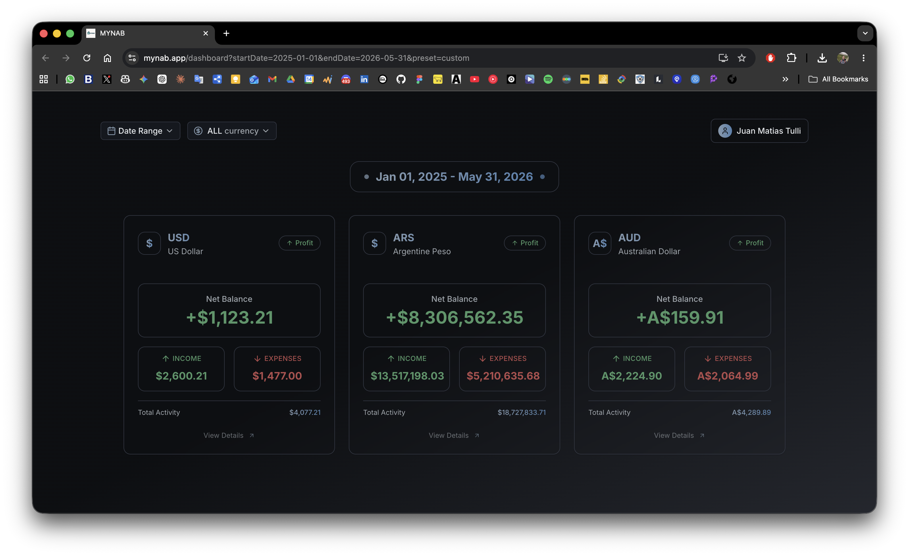
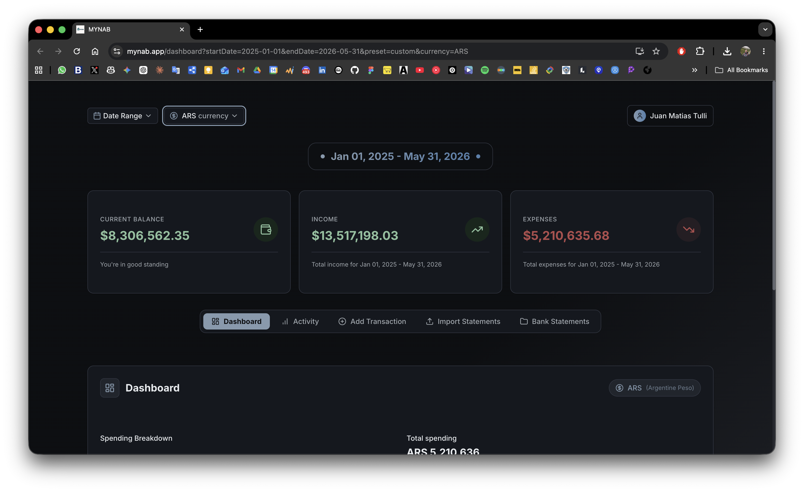
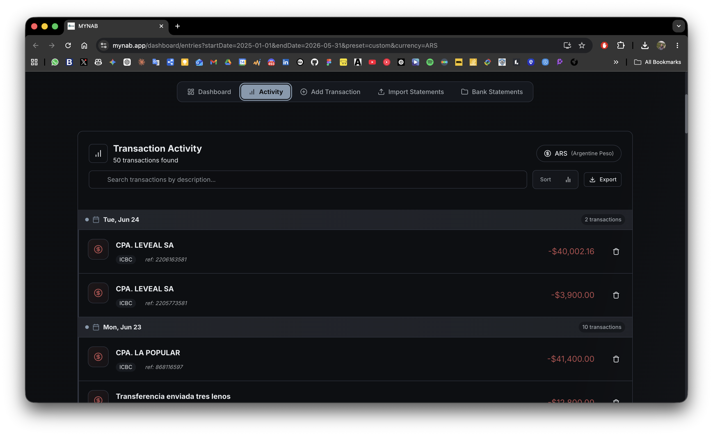
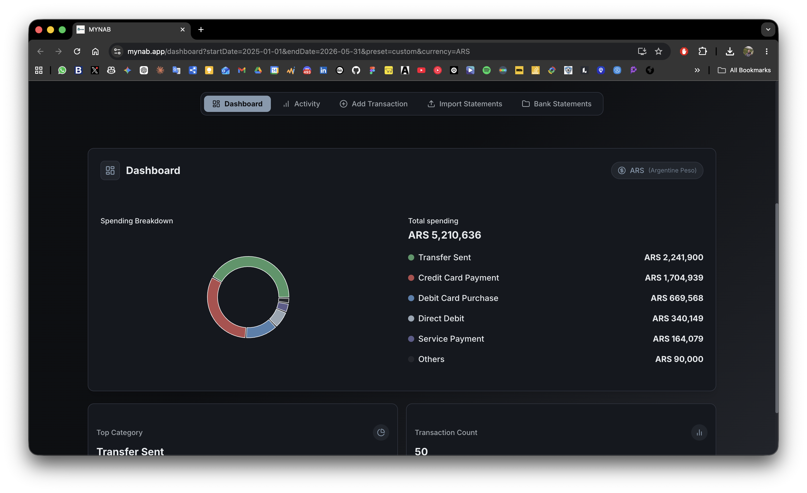
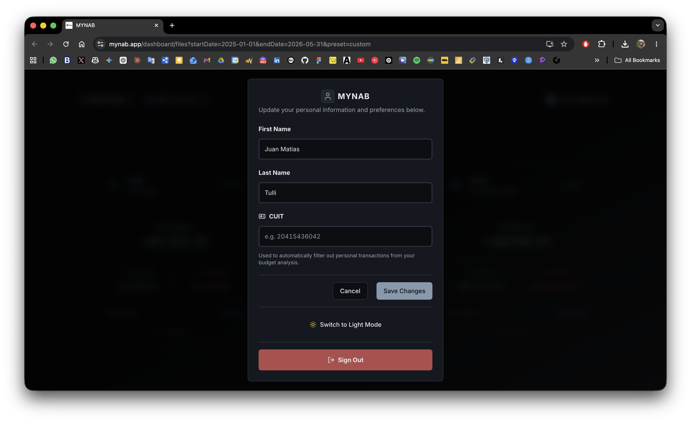
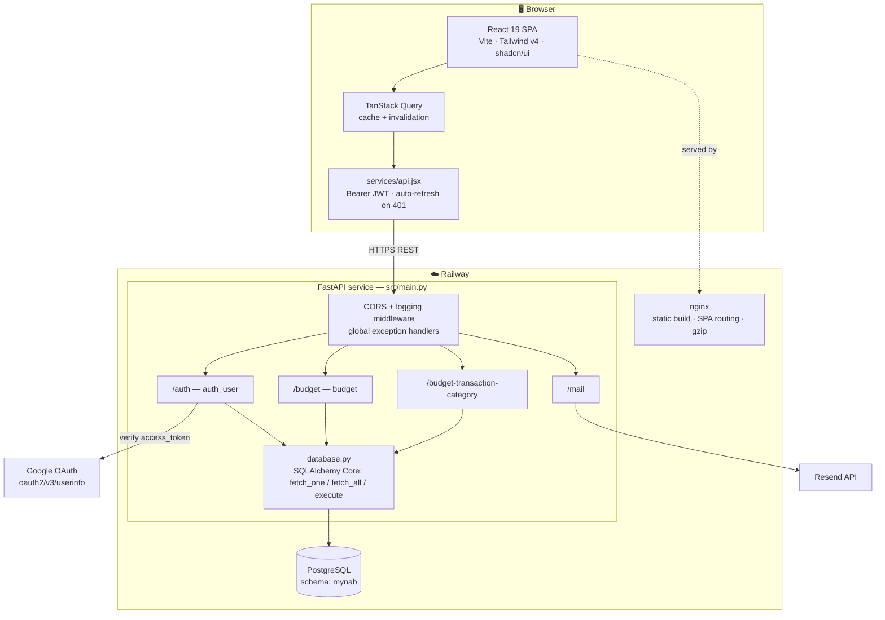
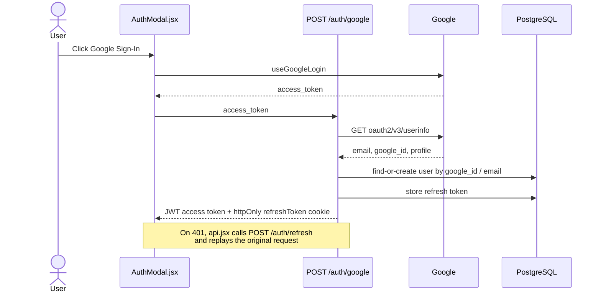
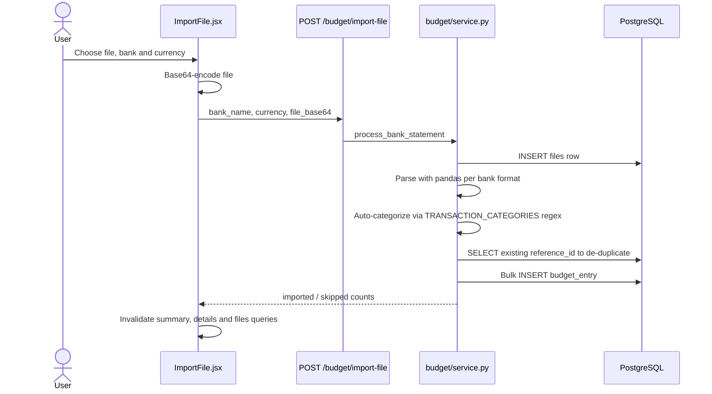
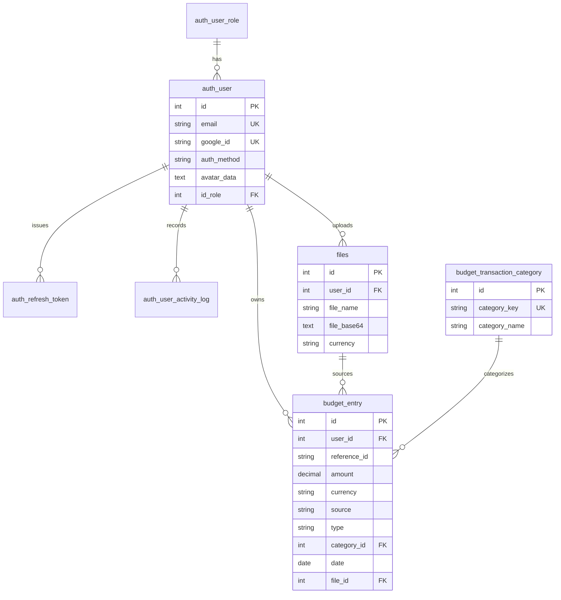

# 💰 MYNAB - Maybe You Need A Budget

A modern, feature-rich personal budgeting application built with **FastAPI** backend and **React** frontend. MYNAB helps you track expenses, manage multiple currencies, and take control of your finances.

---

## 🎯 Features

- 📊 **Multi-Currency Support** - Manage finances across multiple currencies simultaneously
- 💳 **Transaction Management** - Track income and expenses with automatic categorization
- 📁 **Bank Statement Import** - Support for multiple bank formats (Santander Rio, ICBC, BBVA, MercadoPago, CommBank, Revolut)
- 🔐 **Secure Authentication** - Google Sign-In with short-lived JWTs and httpOnly refresh tokens
- 🎨 **Modern UI** - Responsive design with light/dark theme support
- 📱 **PWA Ready** - Install as a web application on your device
- 🔄 **Real-time Updates** - Stay synchronized with your budget in real-time

---

## 📸 Screenshots

### Dashboard - Multi-Currency Overview
View all your currencies at a glance with summary cards showing net balance, income, and expenses.

### Dashboard - Currency-Specific View
Zoom into a specific currency with detailed financial metrics and performance indicators.

### Activity Tracking
Monitor your transactions with a detailed activity log filtered by currency.

### Detailed Dashboard
Explore comprehensive spending breakdowns and financial summaries for any currency.

### User Profile
Manage your account settings and personal information.

---

## 🏗️ System Design

### High-level architecture

Two Railway services: an nginx container serving the compiled Vite SPA, and a FastAPI
container that runs Alembic migrations on boot and talks to PostgreSQL.

```mermaid
graph TB
    subgraph Browser["🖥️ Browser"]
        SPA["React 19 SPA<br/>Vite · Tailwind v4 · shadcn/ui"]
        RQ["TanStack Query<br/>cache + invalidation"]
        APIC["services/api.jsx<br/>Bearer JWT · auto-refresh on 401"]
        SPA --> RQ --> APIC
    end

    subgraph Railway["☁️ Railway"]
        NGX["nginx<br/>static build · SPA routing · gzip"]

        subgraph Service["FastAPI service — src/main.py"]
            MW["CORS + logging middleware<br/>global exception handlers"]
            AUTH["/auth — auth_user"]
            BUD["/budget — budget"]
            CAT["/budget-transaction-category"]
            MAILR["/mail"]
            DBH["database.py<br/>SQLAlchemy Core: fetch_one / fetch_all / execute"]
        end

        PG[("PostgreSQL<br/>schema: mynab")]
    end

    GOOG["Google OAuth<br/>oauth2/v3/userinfo"]
    RESEND["Resend API"]

    SPA -.served by.-> NGX
    APIC -->|HTTPS REST| MW
    MW --> AUTH & BUD & CAT & MAILR
    AUTH -->|verify access_token| GOOG
    MAILR --> RESEND
    AUTH --> DBH
    BUD --> DBH
    CAT --> DBH
    DBH --> PG
```

Each backend domain module follows the same shape: `router.py` → `service.py` → `database.py`,
with Pydantic models in `schemas.py`. There is no ORM or session layer — statements are built
with SQLAlchemy Core and passed to the three async helpers.

### Authentication flow

JWTs are short-lived and held in `localStorage`; the refresh token lives in an httpOnly cookie
and both are rotated on refresh.

```mermaid
sequenceDiagram
    actor U as User
    participant C as AuthModal.jsx
    participant A as POST /auth/google
    participant G as Google
    participant DB as PostgreSQL

    U->>C: Click Google Sign-In
    C->>G: useGoogleLogin
    G-->>C: access_token
    C->>A: access_token
    A->>G: GET oauth2/v3/userinfo
    G-->>A: email, google_id, profile
    A->>DB: find-or-create user by google_id / email
    A->>DB: store refresh token
    A-->>C: JWT access token + httpOnly refreshToken cookie
    Note over C,A: On 401, api.jsx calls POST /auth/refresh<br/>and replays the original request
```

### Bank statement import

The distinctive path: the client Base64-encodes the file, the backend dispatches to a
bank-specific pandas parser, auto-categorizes by regex, and de-duplicates before insert.

```mermaid
sequenceDiagram
    actor U as User
    participant C as ImportFile.jsx
    participant R as POST /budget/import-file
    participant S as budget/service.py
    participant DB as PostgreSQL

    U->>C: Choose file, bank and currency
    C->>C: Base64-encode file
    C->>R: bank_name, currency, file_base64
    R->>S: process_bank_statement
    S->>DB: INSERT files row
    S->>S: Parse with pandas per bank format
    S->>S: Auto-categorize via TRANSACTION_CATEGORIES regex
    S->>DB: SELECT existing reference_id to de-duplicate
    S->>DB: Bulk INSERT budget_entry
    S-->>C: imported / skipped counts
    C->>C: Invalidate summary, details and files queries
```

| Bank | File format | Parser |
|------|-------------|--------|
| `santander_rio` | `.xlsx` | `_process_santander_rio_format` |
| `icbc` | `.csv` | `_process_icbc_format` |
| `bbva` | `.xls` (header row 3) | `_process_bbva_format` |
| `mercado_pago` | `.pdf` | `_process_mercado_pago_format` |
| `comm_bank` | `.csv` (headerless) | `_process_comm_bank_format` |
| `revolut` | `.csv` | `_process_revolut_format` |

### Data model

```mermaid
erDiagram
    auth_user_role ||--o{ auth_user : "has"
    auth_user ||--o{ auth_refresh_token : "issues"
    auth_user ||--o{ auth_user_activity_log : "records"
    auth_user ||--o{ files : "uploads"
    auth_user ||--o{ budget_entry : "owns"
    files ||--o{ budget_entry : "sources"
    budget_transaction_category ||--o{ budget_entry : "categorizes"

    auth_user {
        int id PK
        string email UK
        string google_id UK
        string auth_method
        text avatar_data
        int id_role FK
    }
    files {
        int id PK
        int user_id FK
        string file_name
        text file_base64
        string currency
    }
    budget_entry {
        int id PK
        int user_id FK
        string reference_id
        decimal amount
        string currency
        string source
        string type
        int category_id FK
        date date
        int file_id FK
    }
    budget_transaction_category {
        int id PK
        string category_key UK
        string category_name
    }
```

Deleting a file cascades to the `budget_entry` rows imported from it.
